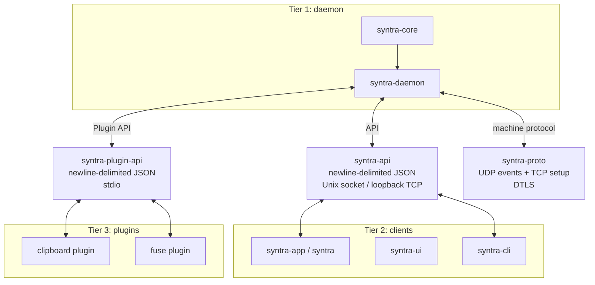

# Syntra

[](https://github.com/DarkPhilosophy/syntra/actions/workflows/rust.yml) [](https://github.com/DarkPhilosophy/syntra/actions/workflows/docs.yml) [](https://www.gnu.org/licenses/gpl-3.0.html)  

Syntra shares mouse, keyboard, clipboard and files between machines on a local network. It is a hard fork with an independent codebase and no upstream relationship.

<!-- VERSION-START -->
<!-- VERSION-END -->

## Architecture



`syntra-api`, `syntra-plugin-api` and `syntra-proto` are separate contracts. The first is daemon-to-client IPC and has no internal dependencies; the second is daemon-to-plugin stdio IPC; the third is machine-to-machine networking.

<!-- CRATES-START -->
<!-- CRATES-END -->

## Platform support

| Platform | Capture | Emulation | Notes |
|---|---|---|---|
| Linux | layer-shell, libei, X11 (feature-gated) | wlroots, libei, RDP, X11 (feature-gated) | Backend availability depends on the desktop and selected features. |
| macOS | Not enabled by the current capture feature resolver | Not enabled by the current emulation feature resolver | Desktop UI code exists; input support is not verified here. |
| Windows | Not enabled by the current capture feature resolver | Not enabled by the current emulation feature resolver | Desktop UI code exists; input support is not verified here. |
| Android | Not enabled by the current desktop backend resolver | Not enabled by the current desktop backend resolver | Android UI/build scaffolding exists; a complete supported session is not verified. |
| iOS | Not implemented | Not implemented | Planned, not a supported target. |

## Installation and building

Use the immutable-host build container:

```bash
distrobox enter "$SYNTRA_BUILD_CONTAINER" -- bash -lc 'cd /var/home/alexa/Projects/Syntra && cargo build --workspace --features syntra-daemon/layer_shell_capture,syntra-daemon/x11_capture,syntra-daemon/libei_capture,syntra-daemon/wlroots_emulation,syntra-daemon/libei_emulation,syntra-daemon/rdp_emulation,syntra-daemon/x11_emulation'
```

Release packages, when available, are published on the [Releases](https://github.com/DarkPhilosophy/syntra/releases) page. Building from source is the authoritative route for the current tree.

## Usage

- `syntra` opens the Slint dashboard. It can start a temporary child daemon when no daemon is reachable and reattach to an independent daemon when one is running.
- `syntra --background` starts the dashboard in background/tray mode.
- `syntra-daemon` runs the daemon without a UI.

On Linux, install the daemon as a user service from the release or built executable. Copy the service unit to `~/.config/systemd/user/syntra.service`, ensure its `ExecStart` points at the actual `syntra-daemon` binary, then run:

```bash
systemctl --user daemon-reload
systemctl --user enable --now syntra.service
```

## Configuration

| Variable | Purpose |
|---|---|
| `SYNTRA_LOG` | Global log filter. |
| `SYNTRA_DAEMON_SOCKET` | Override the daemon client socket. |
| `SYNTRA_DIAGNOSTICS_SOCKET` | Override the diagnostics socket. |
| `SYNTRA_CONFIG_DIR` | Override the per-user configuration directory. |

`SYNTRA_LOG` accepts the log filter syntax implemented by `syntra-log`: a global level such as `info`, or comma-separated `subsystem=level` overrides such as `clipboard=trace,input=warn`. Known subsystem names and levels are parsed by the crate; invalid names are rejected.

## Guides

- [Architecture](../docs/architecture.md)
- [Client and daemon API](../docs/api.md)
- [Plugins](../docs/plugins.md)
- [Machine protocol](../docs/protocol.md)

## Project files

- [Contributing](CONTRIBUTING.md)
- [Changelog](CHANGELOG.md)
- [Third-party notices](THIRD_PARTY_NOTICES.md)
- [Funding](FUNDING.yml)
