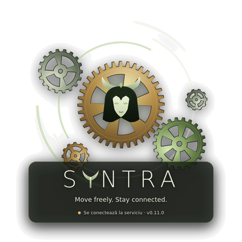
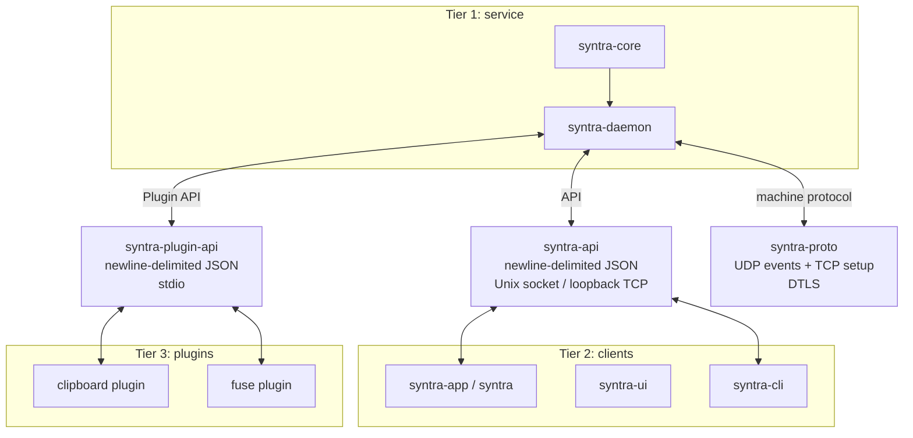

<div align="center">



# Syntra

**One mouse, one keyboard, one clipboard across every computer on your desk.**

[](https://github.com/DarkPhilosophy/Syntra/actions/workflows/rust.yml)
[](https://github.com/DarkPhilosophy/Syntra/actions/workflows/docs.yml)
[](https://github.com/DarkPhilosophy/Syntra/releases)
[](../Cargo.toml)
[](../LICENSE)
[](https://github.com/DarkPhilosophy/Syntra/commits/main)

</div>

Syntra is a software KVM: move the pointer past the edge of one screen and it
continues on the next computer, with the keyboard and clipboard following it.
Everything travels over your local network, encrypted and between devices you
have explicitly authorised.

> [!IMPORTANT]
> Syntra injects keyboard and mouse input into the computers it controls.
> Use it only on devices you own or are authorised to operate, and read the
> [disclaimer](DISCLAIMER.md) before relying on it. The software is provided
> **as is, without any warranty**.

<!-- VERSION-START -->
<p align="center"><b>Current version: 0.11.0</b></p>
<!-- VERSION-END -->

## Contents

- [Features](#features)
- [Quick start](#quick-start)
- [Using Syntra](#using-syntra)
- [Platform support](#platform-support)
- [Installing and building](#installing-and-building)
- [Configuration](#configuration)
- [Troubleshooting](#troubleshooting)
- [Architecture](#architecture)
- [Project](#project)

## Features

- **Seamless pointer and keyboard** — cross a screen edge and keep working on
  the neighbouring machine; modifier state and held keys are released safely
  when control leaves or a peer disappears.
- **Kernel-level input on Linux** — the `uinput` backend behaves like a real
  USB device: it works on GNOME, KDE, wlroots and X11, needs no portal
  consent and keeps working at the lock screen.
- **Independent pointer per device** — optionally give every connected
  machine its own cursor instead of moving yours.
- **Clipboard sharing** — text, images and copied files, with a searchable,
  pinnable history.
- **File transfer** — send files directly to another device.
- **Discovery and authorisation** — nearby devices are found automatically;
  nothing is controlled until you approve its certificate fingerprint.
- **Diagnostics** — a live, filterable log with local timestamps and copy.

## Quick start

1. **Install** Syntra on every computer ([releases](https://github.com/DarkPhilosophy/Syntra/releases)
   or [build from source](#installing-and-building)).
2. **Linux only:** allow kernel-level input once per machine:
   ```bash
   sudo install -Dm644 build-aux/60-syntra-uinput.rules /etc/udev/rules.d/60-syntra-uinput.rules
   echo uinput | sudo tee /etc/modules-load.d/syntra-uinput.conf
   sudo modprobe uinput && sudo udevadm control --reload && sudo udevadm trigger --name-match=uinput
   ```
3. **Start the dashboard** with `syntra`. It starts the background service
   if none is running.
4. **Add the other computer** under *Devices*: pick it from *Discovered*, or
   enter its host name or address, then choose on which side of this screen
   it sits.
5. **Authorise it** under *Authorization* on both machines by comparing the
   fingerprints shown.
6. **Push the pointer** past the chosen edge. Push it back to return.

## Using Syntra

| Page | What it is for |
|---|---|
| **Overview** | Service status, start/stop, and the most-used switches. |
| **Devices** | Add, arrange and edit computers; discovered devices can be added with one click. |
| **Authorization** | This machine's fingerprint and the devices allowed to connect. |
| **Control** | Capture and emulation state, and *Independent pointer per device*. |
| **Clipboard** / **History** | What is shared, and everything that was. |
| **Transfers** | Send files and follow transfers in progress. |
| **Settings** | Appearance, language, port, file reception. |
| **Plugins** / **Diagnostics** | Helper processes, and the live log. |

Command line:

- `syntra` — dashboard; `syntra --background` starts it in the tray.
- `syntra-daemon` — the service without any interface.

Run the service from boot on Linux, with or without a desktop session:

```bash
install -Dm644 service/syntra.service ~/.config/systemd/user/syntra.service
install -Dm644 service/syntra-session.service ~/.config/systemd/user/syntra-session.service
systemctl --user daemon-reload
systemctl --user enable --now syntra.service syntra-session.service
loginctl enable-linger "$USER"   # keep it running while logged out
```

The service is not tied to a graphical session, so a machine logged out of its
desktop (a Steam Deck, a box nobody sits at) can still be controlled through
uinput. `syntra-session.service` restarts it when a desktop session starts, so
capture backends that need the desktop are tried again.

## Platform support

| Platform | Capture | Emulation | Notes |
|---|---|---|---|
| Linux | layer-shell, libei, X11 | **uinput** (preferred), wlroots, libei, RDP portal, X11 | uinput needs write access to `/dev/uinput` (see [Quick start](#quick-start)); otherwise the next backend is used. |
| macOS | not yet enabled | not yet enabled | Dashboard builds; input backends are not verified. |
| Windows | not yet enabled | not yet enabled | Dashboard builds; input backends are not verified. |
| Android | — | — | Dashboard scaffolding only; no supported session yet. |
| iOS | — | — | Planned. |

## Installing and building

Prebuilt packages are attached to each [release](https://github.com/DarkPhilosophy/Syntra/releases).
To build from source on Linux:

```bash
cargo build --release -p syntra-app -p syntra-daemon \
  --features syntra-daemon/layer_shell_capture,syntra-daemon/x11_capture,syntra-daemon/libei_capture,syntra-daemon/wlroots_emulation,syntra-daemon/libei_emulation,syntra-daemon/rdp_emulation,syntra-daemon/uinput_emulation,syntra-daemon/x11_emulation
cargo build --release -p syntra-plugin-clipboard -p syntra-plugin-fuse -p syntra-plugin-edge-glow
```

System packages (Debian/Ubuntu names): `libx11-dev libxtst-dev libei-dev
libxkbcommon-dev libwayland-dev libgtk-4-dev libfuse3-dev libfontconfig-dev
pkg-config`. On immutable hosts, build inside a container such as distrobox.

## Configuration

| Variable | Purpose |
|---|---|
| `SYNTRA_LOG` | Log filter: a level such as `info`, or `subsystem=level` pairs such as `clipboard=trace,input=warn`. |
| `SYNTRA_DAEMON_SOCKET` | Override the service's client socket. |
| `SYNTRA_DIAGNOSTICS_SOCKET` | Override the diagnostics socket. |
| `SYNTRA_CONFIG_DIR` | Override the configuration directory. |
| `SYNTRA_POINTER_AREA` | Desktop size for independent pointers, e.g. `3840x2160`, when detection is wrong. |

## Troubleshooting

- **The pointer does not cross** — both machines must list each other under
  *Authorization*, and the edge chosen under *Devices* must match the
  physical layout.
- **Input is ignored on Linux** — check `ls -l /dev/uinput`; without access
  Syntra falls back to portal backends, which ask for consent per session.
- **An independent pointer moves too fast or too slow** — set
  `SYNTRA_POINTER_AREA` to the logical desktop size.
- **Anything else** — open *Diagnostics*, reproduce the problem, press
  *Copy all* and attach the result to a
  [bug report](https://github.com/DarkPhilosophy/Syntra/issues/new/choose)
  after removing addresses and names.

## Architecture


```mermaid
flowchart TB
  subgraph T1[Tier 1: service]
    Core[syntra-core]
    Daemon[syntra-daemon]
  end
  subgraph T2[Tier 2: clients]
    App[syntra-app / syntra]
    UI[syntra-ui]
    CLI[syntra-cli]
  end
  subgraph T3[Tier 3: plugins]
    Clipboard[clipboard plugin]
    Fuse[fuse plugin]
  end
  API[syntra-api\nnewline-delimited JSON\nUnix socket / loopback TCP]
  PluginAPI[syntra-plugin-api\nnewline-delimited JSON\nstdio]
  Proto[syntra-proto\nUDP events + TCP setup\nDTLS]
  Core --> Daemon
  Daemon <-->|API| API
  API <--> App
  API <--> CLI
  Daemon <-->|Plugin API| PluginAPI
  PluginAPI <--> Clipboard
  PluginAPI <--> Fuse
  Daemon <-->|machine protocol| Proto
```

`syntra-api` (service ↔ clients), `syntra-plugin-api` (service ↔ plugins)
and `syntra-proto` (machine ↔ machine) are separate, versioned contracts.
Guides: [architecture](../docs/architecture.md) · [client API](../docs/api.md)
· [plugins](../docs/plugins.md) · [protocol](../docs/protocol.md).

<details>
<summary>Workspace crates</summary>

<!-- CRATES-START -->
- [`syntra-api`](../crates/syntra-api) — Syntra control API: the versioned contract between the daemon and its clients
- [`syntra-app`](../crates/syntra-app) — Syntra desktop dashboard: a client of the Syntra daemon
- [`syntra-cli`](../crates/syntra-cli) — CLI Frontend for syntra
- [`syntra-core`](../crates/syntra-core) — Syntra daemon core: input routing, peer transport, clipboard, transfers and history. Contains no user-interface code.
- [`syntra-daemon`](../crates/syntra-daemon) — Syntra background service: input sharing, clipboard and file transfer daemon
- [`syntra-input-capture`](../crates/syntra-input-capture) — cross-platform syntra-input-capture library used by syntra
- [`syntra-input-emulation`](../crates/syntra-input-emulation) — cross-platform input emulation library used by syntra
- [`syntra-input-event`](../crates/syntra-input-event) — cross-platform syntra-input-event types for syntra-input-capture / syntra-input-emulation
- [`syntra-log`](../crates/syntra-log) — Runtime-reconfigurable, per-subsystem logging shared by every Syntra process
- [`syntra-plugin-api`](../crates/syntra-plugin-api) — Versioned external-process adapter protocol for Syntra file clipboard integration
- [`syntra-plugin-clipboard`](../plugins/clipboard) — Workspace crate.
- [`syntra-plugin-fuse`](../plugins/fuse) — Workspace crate.
- [`syntra-plugin-edge-glow`](../plugins/edge-glow) — Workspace crate.
- [`syntra-proto`](../crates/syntra-proto) — network protocol for syntra
- [`syntra-store`](../crates/syntra-store) — persistent clipboard history storage and daemon worker for Syntra
- [`syntra-ui`](../crates/syntra-ui) — frontend-neutral presentation state and transport boundary for syntra
<!-- CRATES-END -->

</details>

## Project

- [Contributing](CONTRIBUTING.md) · [Code of conduct](CODE_OF_CONDUCT.md) · [Security policy](SECURITY.md)
- [Changelog](CHANGELOG.md) · [Third-party notices](THIRD_PARTY_NOTICES.md)
- [Disclaimer and acceptable use](DISCLAIMER.md)
- Splash design: [interactive mock](../docs/brand/splash-mock.html)

Syntra is free software under the [GNU General Public License v3.0 or
later](../LICENSE). It comes with **no warranty**, to the extent permitted by
applicable law.

"Syntra" is used here only as the name of this open-source project; it is not
affiliated with, or endorsed by, any other organisation using a similar name.
