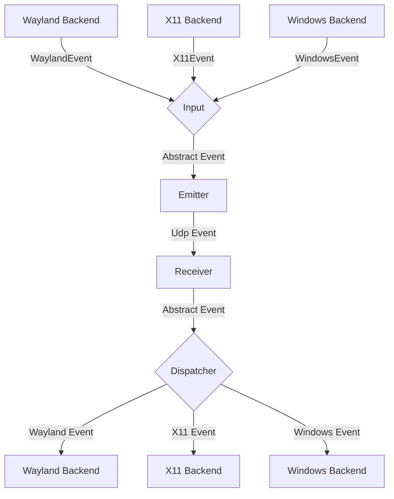
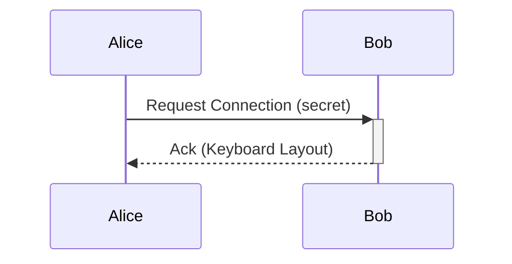

# Frontend and platform boundary

The desktop presentation uses Slint by default. Slint is backed by Rust and the existing
service/IPC contract; it consumes frontend-neutral snapshots and emits typed intents without
duplicating networking, capture, emulation, clipboard, transfer, or authorization state.
Navigation collapses into a compact layout for narrow windows. Fluent locale bundles and the
runtime localization observer are present, but visible-string binding is still in progress;
the documentation does not claim every screen is translated live yet.
GTK is retained only for the separately packaged Linux
`syntra-plugin-gtk-clipboard` clipboard helper. The FUSE helper remains separately
packaged when file transfer is enabled. This helper distinction does not change clipboard or
protocol behavior.
Android has an in-tree Gradle/Slint host and lifecycle/transport foundations, but is not yet a
verified supported Syntra target. Its current capability model reports capture, emulation,
and file clipboard transfer as unavailable; an APK build alone is not evidence of end-to-end
Android support.

## Device profiles

The service exchanges display names and optional avatars over existing authenticated peer
transports. Profiles are keyed by the peer's certificate fingerprint, not its hostname,
network address, or recyclable UI handle. Display names do not change DNS configuration or
pairing. Profile updates do not require remote input sharing to be enabled.

Names are limited to 128 UTF-8 bytes and avatars to 128×128 RGBA pixels. Avatar transfers use
bounded datagrams, bounded partial reassembly, and limited retries. Validated local and peer
profiles are cached in `device-profiles/` beside the service configuration, with hashed
fingerprint filenames. IPC snapshots include cached profiles so a reconnecting frontend can
restore them without waiting for another profile transfer.

## Manual file transfer

Manual file transfer is a distinct path from automatic clipboard and FUSE synchronization.
It targets only connected, authenticated peers and can be initiated by clicking a peer or
using native file drop. The receiver is shown metadata before acceptance; file contents are
not delivered until the transfer is accepted. The default destination is Downloads and is
editable. Transfers never overwrite an existing file. Automatic acceptance is opt-in and
defaults to `false`.

The Linux Slint UI's native file-drop path depends on XWayland; this does not alter daemon
Wayland input capture. This document does not claim Windows or macOS runtime verification.

## Diagnostic output

Diagnostic output is queued separately from the service event loop. If a launcher's stderr
pipe stops draining, the bounded logging queue may drop log lines rather than block input,
networking, or IPC. For persistent remote launches, prefer a log file or systemd journal.

## Clipboard history and input readiness

History changes are announced by the storage worker after successful mutations. A visible
History page coalesces those notifications into queries using the current search filter;
Clear also refreshes the page after its result, including partial failures. Source devices
are presented by their saved name and avatar rather than their certificate fingerprint.
Native portal observation accepts PNG and JPEG image offers, decodes them off the input
event loop, and bounds decoded RGBA content to the history store's 32 MiB image limit.

Starting input sharing requests any missing capture/emulation backend permissions.
Requested sharing and actual backend readiness are separate: the interface must not report
input as running before both backends are ready. System permission approval remains an
interactive user action; stopping input sharing does not stop clipboard or peer transport.

# General Software Architecture

## Events

Each instance of syntra can emit and receive events, where
an event is either a mouse or keyboard event for now.

The general Architecture is shown in the following flow chart:

### Input
The input component is responsible for translating inputs from a given backend
to a standardized format and passing them to the event emitter.

### Emitter
The event emitter serializes events and sends them over the network
to the correct client.

### Receiver
The receiver receives events over the network and deserializes them into
the standardized event format.

### Dispatcher
The dispatcher component takes events from the event receiver and passes them
to the correct backend corresponding to the type of client.

## Requests

// TODO this currently works differently

Aside from events, requests can be sent via a simple protocol.
For this, a simple tcp server is listening on the same port as the udp
event receiver and accepts requests for connecting to a device or to
request the keymap of a device.

## Problems
The general Idea is to have a bidirectional connection by default, meaning
any connected device can not only receive events but also send events back.

This way when connecting e.g. a PC to a Laptop, either device can be used
to control the other.

It needs to be ensured, that whenever a device is controlled the controlled
device does not transmit the events back to the original sender.
Otherwise events are multiplied and either one of the instances crashes.

To keep the implementation of input backends simple this needs to be handled
on the server level.

## Device State - Active and Inactive
To solve this problem, each device can be in exactly two states:

Either events are sent or received.

This ensures that
- a) Events can never result in a feedback loop.
- b) As soon as a virtual input enters another client, syntra will stop receiving events,
which ensures clients can only be controlled directly and not indirectly through other clients.

