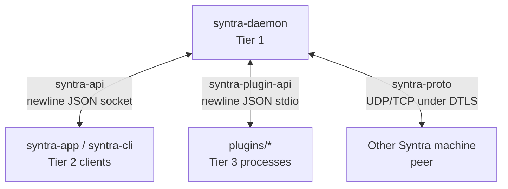

# Syntra documentation

The maintained documentation starts at [`docs/README.md`](docs/README.md). That index routes readers to the architecture, client API, plugin, peer protocol, logging and configuration references.

## Choose the right contract

Do not conflate these boundaries. `syntra-api` is local daemon-to-client IPC; `syntra-plugin-api` is daemon-to-plugin process communication; `syntra-proto` is machine-to-machine networking. Each guide records its framing, ownership and limitations.

## Guides

- [Documentation index](docs/README.md) — audience routing and contract map.
- [Architecture](docs/architecture.md) — tiers, process boundaries and data flow.
- [Client API](docs/api.md) — socket transport, requests, events and compatibility.
- [Plugins](docs/plugins.md) — manifests, supervision and stdio protocol.
- [Peer protocol](docs/protocol.md) — DTLS setup and machine-to-machine messages.
- [Logging](docs/logging.md) — subsystem filters and diagnostics.
- [Configuration](docs/configuration.md) — TOML settings, identity and overrides.

## Repository facts

The workspace is Rust 2021, version `0.11.0`, licensed GPL-3.0-or-later and maintained at [github.com/DarkPhilosophy/syntra](https://github.com/DarkPhilosophy/syntra). Linux, macOS, Windows and Android are represented in the workspace; iOS is planned. Build and feature-selection details belong in the canonical README and the relevant guide, not in this signpost.

## Build note

Builds are performed in the project container. Consult the canonical README for the exact command and Linux feature list before compiling. This file intentionally remains a navigation page so that operational instructions have one maintained home.
