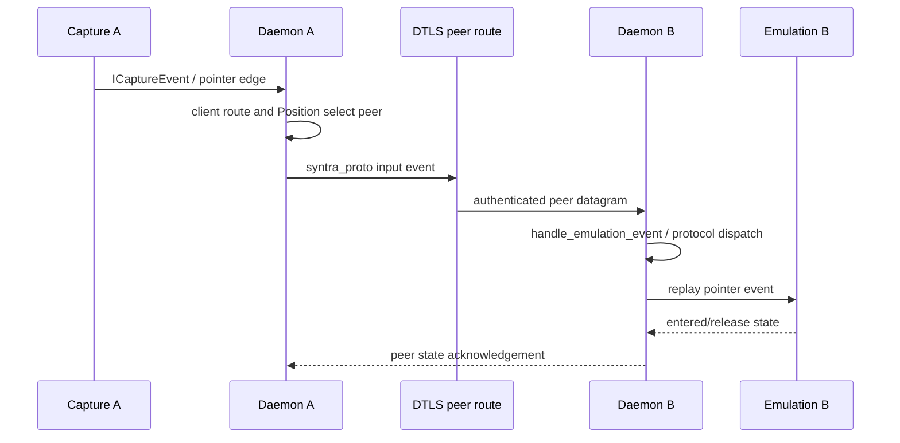
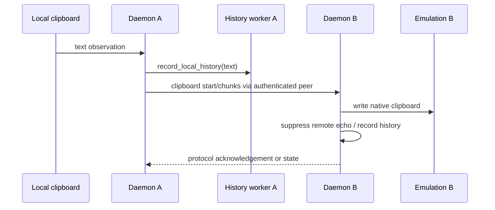
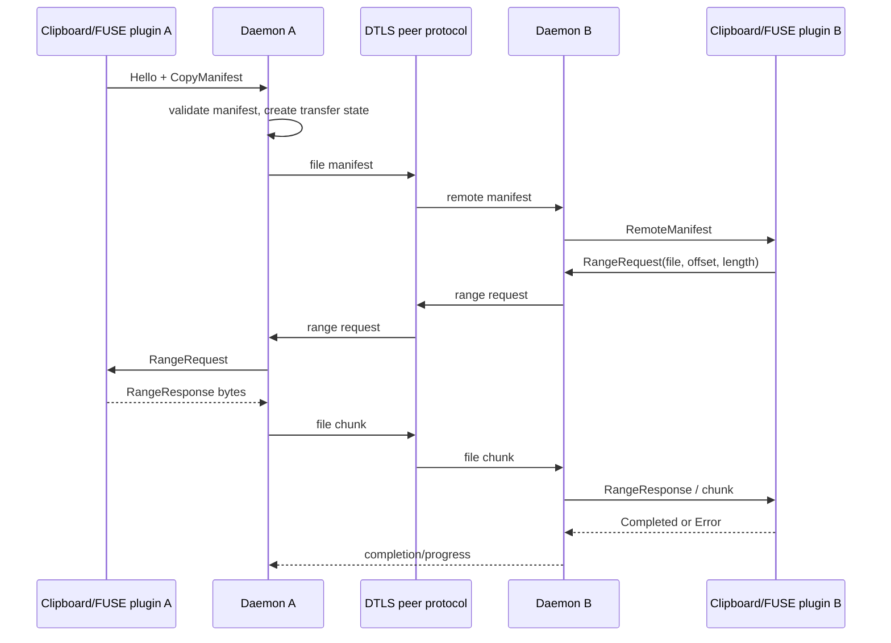

# Architecture

This document describes the running system, not an aspirational design. The source of truth is the Rust workspace and the executable architecture test. Paths in parentheses are source citations; line numbers refer to the current checkout.

## 1. Dependency tiers

Syntra is deliberately split into three tiers:

| Tier | Crates/processes | Owns | Must not know |
|---|---|---|---|
| 1. Service | `syntra-core`, binary `syntra-daemon` | Capture, emulation, authenticated peer transport, discovery, clipboard/history, transfers, plugins, configuration and the client contract | Slint, windows, tray or presentation state |
| 2. Clients | `syntra-app`, `syntra-ui`, `syntra-cli` | Window/tray, presentation models, user intents and command-line control | Core capture/emulation implementations or private daemon state |
| 3. Plugins | Separate programs in `plugins/` | Optional clipboard/file integration in a process boundary | The daemon's internal Rust types and UI lifecycle |

The service tier is split because the daemon must be installable as a headless user service. `syntra-daemon` constructs `Service` and explicitly documents that it knows nothing about a user interface (`crates/syntra-daemon/src/main.rs:1-7`). `Service` owns capture, emulation, discovery, the frontend listener, history, transfer state and plugin supervision (`crates/syntra-core/src/service/mod.rs:63-149`).

The dashboard is a client, not a second daemon. The application links the UI and `syntra-api`, and the module documentation states that it never links daemon core (`crates/syntra-app/src/main.rs:1-10`). Its window can therefore open while the service is absent, and it can reconnect later (`crates/syntra-ui/src/app.rs:134-161`). The CLI is likewise a client command selected by the daemon executable's command parser, but its control surface remains the API rather than `Service` internals (`crates/syntra-daemon/src/main.rs:71-87`).

Plugins are processes supervised by the daemon. During construction, executable paths are resolved beside the daemon; absent helpers only disable that capability rather than preventing the service from starting (`crates/syntra-core/src/service/mod.rs:241-268`). The daemon's registry discovers manifests and clients render the resulting snapshot; clients do not launch or own plugin processes (`crates/syntra-core/src/service/mod.rs:145-148,350-355`).

### The four enforced rules

The architecture test contains these four rules verbatim:

> The daemon must not be installable on a headless machine.

This is the test's comment wording, but the assertion below expresses the intended prohibition: `syntra-daemon` must not reach `syntra-ui` or `syntra-app` (`crates/syntra-daemon/tests/architecture.rs:84-100`). In practical terms it prevents Slint, a windowing backend and tray code entering a boot-time service.

> The dashboard must be installable and runnable without the service stack.

The assertion forbids `syntra-core`, `syntra-input-capture` and `syntra-input-emulation` in the dashboard's reachable workspace graph (`crates/syntra-daemon/tests/architecture.rs:102-124`). This prevents a missing platform backend from stopping the dashboard before it can report a disconnected service.

> Both tiers must meet on the shared contract rather than on private types.

Both `syntra-daemon` and `syntra-app` must reach `syntra-api` (`crates/syntra-daemon/tests/architecture.rs:126-141`). This prevents an accidental private coupling that would bypass the documented client boundary.

> The contract crate is what third parties compile against.

`syntra-api` must reach no other workspace crate (`crates/syntra-daemon/tests/architecture.rs:143-161`). This prevents a third-party client or plugin from having to build the core, UI or a platform backend merely to speak control IPC.

The test comments explain the failure each rule prevents: the graph is resolved from `cargo metadata`, so a convenient dependency can silently collapse a boundary even when manifests look harmless (`crates/syntra-daemon/tests/architecture.rs:1-10`).

## 2. Three distinct wire contracts

Do not conflate these protocols:

| Contract | Parties | Transport | Purpose |
|---|---|---|---|
| `syntra-api` | Daemon ↔ dashboard, CLI and other clients | Newline-delimited JSON over a Unix socket; loopback TCP on Windows | Requests and authoritative `FrontendEvent` state |
| `syntra-plugin-api` | Daemon ↔ plugin process | Newline-delimited JSON over stdin/stdout | Capability negotiation, clipboard manifests, ranges, progress and completion |
| `syntra-proto` | Machine A ↔ machine B | UDP events and TCP setup under DTLS | Input, clipboard, history, profiles and file-transfer peer messages |

The API crate intentionally has no workspace dependencies and exposes blocking and asynchronous connection helpers (`crates/syntra-api/src/lib.rs:1-24,42-49`). Its reader parses one JSON value per line and its writer appends a newline (`crates/syntra-api/src/connect.rs:31-49`). The peer protocol is hand-encoded for cross-version, cross-architecture stability (`crates/syntra-proto/src/lib.rs:1-16`). Plugin messages use an explicit `type`/`data` representation and are newline-terminated JSON (`crates/syntra-plugin-api/src/lib.rs:261-328`).

## 3. Runtime processes and ownership

A normal desktop may contain:

1. `syntra`, the dashboard process and Slint event loop.
2. `syntra-daemon`, the headless service process.
3. Zero or more plugin children, such as clipboard and FUSE adapters.
4. The daemon's backend threads/tasks and the dashboard's event-pump worker; these are not additional user-facing processes.

The dashboard creates a multi-thread Tokio runtime because D-Bus and tray integrations need a reactor while Slint owns the main thread (`crates/syntra-app/src/main.rs:20-38`). It calls `ensure_daemon`, then runs the UI and drops its ownership guard on exit (`crates/syntra-app/src/main.rs:40-57`).

### `ensure_daemon`: three branches

`ensure_daemon` is deliberately best effort (`crates/syntra-app/src/main.rs:87-114`):

1. **Attach.** A short probe succeeds, so the dashboard uses the already-running daemon and returns no guard. Closing the dashboard does not stop that daemon (`crates/syntra-app/src/main.rs:92-96`).
2. **Start installed service.** The probe fails, but platform service discovery reports an installed unit. The app requests the unit to start and returns no guard. Ownership remains with the service manager; dashboard exit cannot stop it (`crates/syntra-app/src/main.rs:97-103`).
3. **Spawn child.** No installed service is available, so the app resolves a sibling `syntra-daemon` executable (or PATH fallback) and spawns it. The returned `OwnedDaemon` records ownership; dropping it sends SIGINT on Unix (or kills on other platforms), waits, and therefore releases grabbed devices safely (`crates/syntra-app/src/main.rs:104-124,131-150`).

A failure to spawn is non-fatal: the dashboard opens disconnected and continues trying to attach (`crates/syntra-app/src/main.rs:104-111`). The daemon itself treats an already-owned control socket as a normal second-instance outcome and exits successfully (`crates/syntra-daemon/src/main.rs:77-86`).

Plugins are children of the daemon, not of the dashboard. `AdapterProcessManager` is created from paths beside the daemon and is shut down during service termination (`crates/syntra-core/src/service/mod.rs:250-268,503-508`). A missing plugin degrades file/clipboard integration without taking down input sharing (`crates/syntra-core/src/service/mod.rs:250-253`).

## 4. Daemon runtime and event loop

`Service::new` loads or generates the certificate, starts history storage, binds the frontend listener, creates peer capture/emulation, discovers optional mDNS, creates clipboard state, and initialises transfer/plugin state (`crates/syntra-core/src/service/mod.rs:201-283,287-355`). `run` reactivates configured active clients and then waits forever in one `tokio::select!` loop (`crates/syntra-core/src/service/mod.rs:381-402`).

Every arm is significant:

| Arm | Handling |
|---|---|
| `history_changes.changed()` | Publishes `FrontendEvent::HistoryChanged`; recreates the subscription if the sender closed (`crates/syntra-core/src/service/mod.rs:403-409`). |
| `profile_tick.tick()` | Retries profile requests, ticks manual transfers, refreshes routes, and expires incomplete history reassembly (`crates/syntra-core/src/service/mod.rs:410-419`). |
| `frontend_listener.next()` | Decodes one client request; `true` breaks the service loop when the listener requests termination (`crates/syntra-core/src/service/mod.rs:420-422`). |
| `frontend_event_pending.notified()` | Drains queued authoritative events to attached clients (`crates/syntra-core/src/service/mod.rs:423`). |
| `emulation.event()` | Handles remote peer input, connection state, clipboard and protocol events (`crates/syntra-core/src/service/mod.rs:424`). |
| `capture.event()` | Handles local capture, authentication, peer loss/state and clipboard events (`crates/syntra-core/src/service/mod.rs:425`). |
| `adapter_events.recv()` | Routes plugin lifecycle/messages into transfer orchestration; closed channels are ignored (`crates/syntra-core/src/service/mod.rs:426-430`). |
| `source_results.recv()` | Consumes blocking file-read results and advances the transfer state machine (`crates/syntra-core/src/service/mod.rs:431-435`). |
| `clipboard.next_read()` (legacy mode only) | Reads local text/image clipboard, records history and sends a new transfer to clipboard-capable clients (`crates/syntra-core/src/service/mod.rs:436-457`). |
| `resolver.event()` | Applies DNS resolution results to configured clients (`crates/syntra-core/src/service/mod.rs:458`). |
| history-clear deadline | Reports a timed-out global clear, including affected and acknowledging peers (`crates/syntra-core/src/service/mod.rs:459-477`). |
| discovery event | Publishes discovered peers/errors and disables discovery if its stream ends (`crates/syntra-core/src/service/mod.rs:478-489`). |
| `config.changed()` | Reloads runtime configuration through the frontend/config handler (`crates/syntra-core/src/service/mod.rs:490`). |
| `signal::ctrl_c()` | Leaves the loop for orderly shutdown (`crates/syntra-core/src/service/mod.rs:491`). |

Shutdown terminates capture, emulation, discovery, DNS and adapter children in order (`crates/syntra-core/src/service/mod.rs:495-510`).

## 5. Threading and async model

The daemon uses a Tokio **current-thread** runtime and executes the service inside a `LocalSet` (`crates/syntra-daemon/src/main.rs:91-105`). This is not merely an optimisation: capture, emulation and IPC state is `!Send`, and the service shares that state without locks (`crates/syntra-daemon/src/main.rs:91-95`). `LocalSet` permits local futures to remain on the one executor thread while asynchronous I/O and timers interleave through `select!`.

This forbids moving `Service` or its local backend futures to a multi-thread executor, spawning them with `tokio::spawn` where `Send + 'static` is required, or accessing the mutable service concurrently from arbitrary threads. Cross-thread work is explicit: file chunks are read through a bounded channel and handled back on the service loop (`crates/syntra-core/src/service/mod.rs:158,180-194,269-270`; `crates/syntra-core/src/service/transfers.rs:398-433`). The dashboard is different: its UI state is protected by `Arc<Mutex<_>>`, and its generic transport requires `Send` sources/sinks (`crates/syntra-ui/src/app.rs:178-197,204-217`).

## 6. Subsystems

### `frontend`

`frontend.rs` is the sole request boundary. It matches `FrontendRequest`, mutates authoritative daemon state, and publishes resulting `FrontendEvent` values rather than asking clients to predict outcomes (`crates/syntra-core/src/service/frontend.rs:1-5,9-20`). It also publishes plugin snapshots, saves/reloads configuration, queues events and synchronises a newly attached client (`crates/syntra-core/src/service/frontend.rs:325-430`).

Key types are `AsyncFrontendListener`, `FrontendRequest`, `FrontendEvent`, `ClientManager`, `PluginRegistry` and the service's `pending_frontend_events` queue (`crates/syntra-core/src/service/mod.rs:74-90,145-148`; `crates/syntra-api/src/lib.rs:42-49`).

### `clients`

`clients.rs` owns configured outgoing routes: handles, hostnames/IPs, ports, screen positions, activation and DNS resolution (`crates/syntra-core/src/service/clients.rs:1-6,9-180`). A `ClientHandle` is never reused, protecting queued events from being applied to a replacement route (`crates/syntra-api/src/lib.rs:202-203`; `crates/syntra-core/src/service/input.rs:184-197`). Incoming authenticated routes are tracked separately by socket address and fingerprint (`crates/syntra-core/src/service/mod.rs:98-107`; `crates/syntra-core/src/service/clients.rs:182-236`).

### `input`

`input.rs` is the hot path. Capture events are routed to the peer owning the crossed edge, while emulation events are replayed locally (`crates/syntra-core/src/service/input.rs:1-5`). Authentication records fingerprints, state changes start history sync, peer loss drops transfers, and capture begin tells an incoming route to leave (`crates/syntra-core/src/service/input.rs:198-301`). Remote `EmulationEvent::Clipboard` and native clipboard events are dispatched through peer protocol handling (`crates/syntra-core/src/service/input.rs:9-180`).

### `clipboard_sync`

This module records local history and prevents clipboard echo. It rejects file URLs belonging to the daemon's own mount and suppresses duplicate native file selections before forwarding a `ClipboardData` command to a plugin (`crates/syntra-core/src/service/clipboard_sync.rs:1-47`). Legacy text/image polling occurs in the event loop; native portal capture is handled by `input.rs` and deliberately avoids treating a file URI list as ordinary text (`crates/syntra-core/src/service/mod.rs:436-457`; `crates/syntra-core/src/service/input.rs:120-176`).

### `history_reconcile`

History is paged, addressed by request ID and offset, and sent only to authenticated connected peers (`crates/syntra-core/src/service/history_reconcile.rs:1-65`). A global clear snapshots a boundary, creates an operation ID, waits for peer acknowledgements, and reports timeout details through the frontend (`crates/syntra-core/src/service/history_reconcile.rs:68-112`; `crates/syntra-core/src/service/mod.rs:459-477`). The periodic tick expires incomplete pages (`crates/syntra-core/src/service/mod.rs:410-419`).

### `peers`

`peers.rs` is the identity and peer-protocol layer. Routes are deduplicated by certificate fingerprint rather than address, because addresses change (`crates/syntra-core/src/service/peers.rs:1-20`). It requests/retries device profiles, accepts cached profiles, dispatches `syntra_proto::ProtoEvent`, and handles file protocol messages (`crates/syntra-core/src/service/peers.rs:23-40,43-92,94-405`). `Peer::Capture(ClientHandle)` and `Peer::Emulation(SocketAddr)` are the internal route keys (`crates/syntra-core/src/service/mod.rs:174-178`).

### `transfers`

`transfers.rs` bridges three parties: the transfer state machine, out-of-process plugins and clients rendering progress (`crates/syntra-core/src/service/transfers.rs:1-5`). Adapter messages become range requests, manifests, progress, completion or cancellation actions (`crates/syntra-core/src/service/transfers.rs:15-176`). Source reads run in local tasks and return `SourceReadResult`; actions then send peer messages, plugin commands or `TransferFrontendEvent` updates (`crates/syntra-core/src/service/transfers.rs:179-228,326-433`). Manual routes are refreshed whenever authenticated peers change (`crates/syntra-core/src/service/transfers.rs:9-13`).

## 7. Worked flows

### Pointer crossing from A to B

Capture events are discarded if their configured handle was deleted; otherwise the handler records authentication and sends protocol events through the `Peer` route (`crates/syntra-core/src/service/input.rs:184-209`). The edge mapping is configured by `ClientConfig.pos` (`crates/syntra-api/src/lib.rs:175-188`) and client activation establishes the barrier (`crates/syntra-core/src/service/clients.rs:43-67`).

### Text clipboard copy

In legacy mode the event-loop clipboard arm records text and sends a new transfer ID to each clipboard-capable client (`crates/syntra-core/src/service/mod.rs:436-445`). Native peer clipboard handling records the value and writes it through emulation; own-mount and duplicate guards prevent echo (`crates/syntra-core/src/service/clipboard_sync.rs:16-45`).

### File copy through both plugins

Plugin messages include `Hello`, `CopyManifest`, `RemoteManifest`, `RangeRequest`, `RangeResponse`, `Completed`, `Cancelled` and `ClipboardData` (`crates/syntra-plugin-api/src/lib.rs:261-318`). File transfer chunks are bounded for normal MTU safety, and manifests/path names are validated by `syntra-proto` (`crates/syntra-proto/src/lib.rs:23-40,49-80`).

## 8. Client attachment and daemon restart

A desktop client opens a socket through `syntra-api`; on Unix this is the default Unix socket and on Windows it is `127.0.0.1:5252` (`crates/syntra-api/src/connect.rs:77-87`). The dashboard starts detached, initialises a disconnected/reconnecting state, and uses one `IpcEventSource` whose optional reader and writer are replaced atomically under mutexes (`crates/syntra-ui/src/app.rs:199-217,444-467`).

When the reader reaches EOF or an IPC error, it clears both streams and reports `TransportError::Disconnected` (`crates/syntra-ui/src/app.rs:469-490`). The event-pump does not strand the UI: `reconnect` retries indefinitely with 250 ms initial delay and a five-second cap, then primes the new connection with `Sync` and `Enumerate` before publishing it (`crates/syntra-ui/src/app.rs:493-521`). Those requests are essential after restart because pre-restart projections are stale.

The dashboard therefore survives either daemon ownership model: an installed service can restart independently, and an `OwnedDaemon` child is stopped only when the dashboard exits. The window remains open, displays disconnected state during the gap, and reattaches when the socket returns (`crates/syntra-app/src/main.rs:87-114`; `crates/syntra-ui/src/app.rs:134-139`).

## 9. Limitations and weak points

* The daemon and several backend states are `!Send`; the single-thread runtime is required, so one blocking backend operation can still threaten responsiveness if it escapes the explicit blocking-reader path (`crates/syntra-daemon/src/main.rs:91-105`; `crates/syntra-core/src/service/transfers.rs:398-433`).
* The dashboard's reconnection loop retries forever. If a daemon is permanently unavailable, the worker remains alive and the UI can only show degraded state (`crates/syntra-ui/src/app.rs:493-521`).
* `ensure_daemon` starts an installed service without waiting for readiness and does not retain ownership of it; startup races are delegated to the UI's reconnect loop (`crates/syntra-app/src/main.rs:97-103`).
* Plugins are optional and supervised, but a missing or rejected adapter means file/clipboard functionality is unavailable rather than transparently replaced (`crates/syntra-core/src/service/mod.rs:250-268`; `crates/syntra-core/src/service/transfers.rs:164-175`).
* Discovery is best effort. Failure disables mDNS while the rest of the service continues (`crates/syntra-core/src/service/mod.rs:271-283,478-489`).
* Legacy clipboard polling is conditional and platform-dependent; portal/native file selection has separate echo guards, so capability behaviour differs by backend (`crates/syntra-core/src/service/mod.rs:233-240,436-457`; `crates/syntra-core/src/service/input.rs:120-176`).
* File chunks are intentionally limited to a safe datagram size. This avoids fragmentation but increases round trips and can stall transfers when a plugin or peer disappears (`crates/syntra-proto/src/lib.rs:31-40`; `crates/syntra-core/src/service/input.rs:252-263`).
* A global history clear has a bounded deadline and reports partial acknowledgement rather than rolling back already-applied peers (`crates/syntra-core/src/service/mod.rs:459-477`; `crates/syntra-core/src/service/history_reconcile.rs:68-112`).
* Diagnostics mirroring is available on Unix; other platforms use no mirror in daemon initialisation, so the dashboard's live diagnostic view can be unavailable (`crates/syntra-daemon/src/main.rs:53-68`).
* iOS is not an implemented target in the source described here; platform-specific support currently covers Linux, macOS, Windows and Android through the workspace crates and UI entry points (`crates/syntra-ui/src/app.rs:178-197,542-555`).

## 10. Invariants for contributors

The dependency graph is an executable contract, not a convention. A new service feature belongs in `syntra-core` and must communicate with clients through `syntra-api`; adding a UI dependency to the daemon or a core dependency to the dashboard breaks the corresponding architecture assertion (`crates/syntra-daemon/tests/architecture.rs:84-161`).

The daemon is authoritative for mutable state. A frontend request is applied by `frontend.rs`, then the resulting event is queued for every attached client; a client must render the event rather than infer success from its own request (`crates/syntra-core/src/service/frontend.rs:1-5,325-430`). This matters during reconnect, where `Sync` and `Enumerate` replace stale projections (`crates/syntra-ui/src/app.rs:498-516`).

Peer identity is a certificate fingerprint, not a socket address. Addresses are routes that can change; fingerprint maps are used to deduplicate authenticated capture and emulation routes (`crates/syntra-core/src/service/peers.rs:1-20`). Any feature that stores a peer solely by address risks treating a moved or reconnected device as a different device.

Handles and transfer identifiers have different lifetimes. A deleted `ClientHandle` is never reused (`crates/syntra-api/src/lib.rs:202-203`), while clipboard transfer IDs are seeded from process time and process ID so a restarted daemon does not collide with a live remote offer (`crates/syntra-core/src/service/mod.rs:329-336`). File IDs and request IDs are validated by the peer protocol before chunks are accepted (`crates/syntra-proto/src/lib.rs:134-183`).

| Invariant | Observable consequence | Source |
|---|---|---|
| Client events are authoritative | UI state updates after daemon events | `crates/syntra-core/src/service/frontend.rs:1-5` |
| Authenticated routes are fingerprinted | Address changes do not create duplicate peer identity | `crates/syntra-core/src/service/peers.rs:1-20` |
| Deleted handles never return | Queued capture events cannot target a replacement | `crates/syntra-core/src/service/input.rs:184-197` |
| Optional plugins do not gate startup | Input sharing can run without a helper | `crates/syntra-core/src/service/mod.rs:250-268` |
| Local service state is not `Send` | Work remains on `LocalSet` | `crates/syntra-daemon/src/main.rs:91-105` |

## 11. Operational reading order

When diagnosing a failure, identify the boundary first. A dashboard that shows disconnected state is an API/socket or daemon-lifecycle problem, not proof that peer UDP is broken (`crates/syntra-ui/src/app.rs:469-521`). A peer that is connected but cannot move input belongs to capture/emulation and the authenticated route state (`crates/syntra-core/src/service/input.rs:198-301`). A file copy that has a manifest but no bytes belongs to adapter messages, range actions or transfer state (`crates/syntra-core/src/service/transfers.rs:15-228`).

The useful ownership sequence is:

1. Check the dashboard's transport lifecycle and reconnect state.
2. Check whether the daemon owns the frontend socket and whether `Service::run` is alive.
3. Check client activation, DNS/address state and authenticated fingerprints.
4. Check the relevant backend event arm: capture, emulation, clipboard or adapter.
5. Check peer protocol messages and transfer/history state.

This order avoids treating a presentation symptom as a transport diagnosis. The dashboard deliberately remains usable while detached, and the daemon deliberately continues when discovery or an optional plugin is unavailable (`crates/syntra-ui/src/app.rs:134-139`; `crates/syntra-core/src/service/mod.rs:271-283`).
