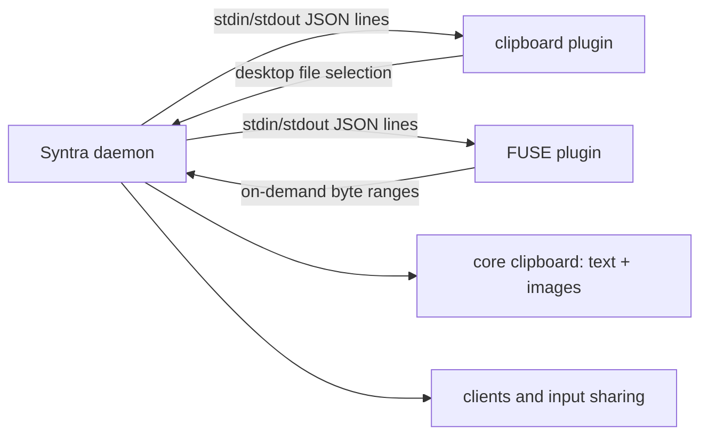

# Plugin author’s guide

This document describes Syntra’s out-of-process plugin contract. It is written for authors who are implementing a new helper, packaging one for users, or debugging an installed helper. The source of truth is the Rust API crate and the daemon supervisor; this guide deliberately calls out current limitations rather than implying future behaviour.

## 1. What a plugin is

A plugin is an executable supervised by the Syntra daemon. It communicates through newline-delimited JSON (one JSON object per line) on standard input and standard output. The daemon owns discovery, enablement, process lifetime, transfer routing, and user-visible status. A client never launches a plugin directly (`crates/syntra-core/src/plugins.rs:3-6`).

Plugins are separate processes for three concrete reasons:

1. **Toolkit isolation.** The GTK clipboard helper needs a graphical session, a display, and a session bus. The daemon is an installable user service that starts at boot, where those desktop facilities may not exist (`plugins/clipboard/src/main.rs:1-6`). Keeping GTK out of the daemon prevents startup ordering and toolkit initialisation from becoming input-sharing failures.
2. **Crash and hang isolation.** The FUSE helper mounts a filesystem, performs blocking operations, and can wedge while a kernel/userspace mount is unhealthy. Its process must not stall input forwarding or take down the daemon (`plugins/fuse/src/main.rs:3-10`).
3. **Optional dependencies.** A missing GTK, FUSE, or third-party runtime must remove one capability, not prevent the service starting. During service construction, failure to prepare plugin paths logs a warning and creates no adapter manager; the service continues (`crates/syntra-core/src/service/mod.rs:250-267`).

The daemon therefore remains useful when plugins are absent, malformed, incompatible, stopped, or crashed. A plugin is an optional capability boundary, not part of the core input path.

### Clipboard terminology—read this first

**Text and image clipboard synchronisation is built into the daemon.** The core clipboard implementation reads text and, when text is unavailable, reads RGBA images; it also writes both kinds back to the local clipboard (`crates/syntra-core/src/clipboard.rs:10-18`, `119-135`, `184-195`). No plugin is needed for those payloads.

Only **file clipboard** integration needs plugins. The bundled GTK clipboard plugin observes desktop file selections and publishes URI-list data. The bundled FUSE plugin exposes a peer’s offered files as a local-looking folder. A plugin advertising `text/uri-list` is not evidence that it owns ordinary text or image clipboard traffic.

## 2. Architecture and ownership



The three wire contracts must not be conflated:

| Contract | Peers | Transport | Purpose |
|---|---|---|---|
| `crates/syntra-api` | daemon and clients | newline-delimited JSON over Unix socket (loopback TCP on Windows) | Dashboard/CLI control and status |
| `crates/syntra-plugin-api` | daemon and plugins | newline-delimited JSON over stdin/stdout | Plugin handshake and file transfers |
| `crates/syntra-proto` | machines | UDP events and TCP setup under DTLS | Device-to-device synchronisation |

A plugin author normally depends only on the message vocabulary in `syntra-plugin-api`. The crate has no internal Syntra dependencies, so another language can implement the same JSON contract without linking the workspace.

## 3. Manifest reference

The daemon reads JSON manifests, not a hard-coded plugin list. The schema is `plugins/manifest.schema.json`.

| Field | Required | JSON type / constraint | Meaning |
|---|---:|---|---|
| `$schema` | no | string URI in examples | Editor/schema hint; ignored by the daemon’s Rust manifest reader |
| `manifest_version` | yes | integer, exactly `1` | Manifest format understood by this daemon |
| `protocol_version` | yes | integer, exactly `1` | Plugin message protocol advertised by the manifest |
| `id` | yes | non-empty string matching `^[A-Za-z0-9._-]+$` | Stable identity used for enablement, status, and replacement |
| `name` | yes | non-empty string | Human-readable name |
| `description` | no | string | One or two sentences shown in the plugin manager |
| `version` | no | string | Plugin release version, ideally semantic versioning |
| `author` | no | string | Responsible person or organisation |
| `homepage` | no | URI string | Project or documentation page |
| `source` | no | URI string | Auditable source-code location |
| `update_url` | no | URI string | Where newer releases are published |
| `license` | no | string | SPDX licence identifier |
| `bundled` | no (schema default false) | boolean | True when shipped and updated with Syntra; bundled entries cannot be uninstalled in the plugin manager |
| `executable` | yes | non-empty string | Executable path; relative paths are resolved beside this manifest |
| `args` | no | array of strings | Fixed arguments appended when the daemon launches the executable |
| `capabilities` | yes | object | Operations and MIME types supported by the process |
| `capabilities.clipboard_read` | yes | boolean | Plugin can announce local clipboard file selections with `CopyManifest` |
| `capabilities.paste` | yes | boolean | Plugin can consume a paste destination/remote manifest |
| `capabilities.cancel` | yes | boolean | Plugin handles cancellation notifications |
| `capabilities.requires_live_mount` | no (default false) | boolean | Plugin expects a live mounted transfer while it is active |
| `capabilities.mime_types` | yes | non-empty array of non-empty strings | Exact desktop MIME identifiers handled by this plugin |

The daemon’s runtime validation additionally requires unique MIME strings and at least one of `clipboard_read` or `paste` (`crates/syntra-plugin-api/src/lib.rs:439-454`). Its executable check requires a regular file and, on Unix, an executable mode bit (`crates/syntra-plugin-api/src/lib.rs:456-477`).

### Fully annotated realistic manifest

The comments below make the example readable; remove comments before saving because JSON itself does not permit them.

```json
{
  "$schema": "../manifest.schema.json",
  "manifest_version": 1,
  "protocol_version": 1,
  "id": "example-file-clipboard",
  "name": "Example file clipboard",
  "description": "Publishes file-manager selections and consumes remote file offers.",
  "version": "1.2.0",
  "author": "Example Organisation",
  "homepage": "https://example.invalid/syntra-plugin",
  "source": "https://example.invalid/syntra-plugin/source",
  "update_url": "https://example.invalid/syntra-plugin/releases",
  "license": "GPL-3.0-or-later",
  "bundled": false,
  "executable": "example-file-plugin",
  "args": ["--stdio"],
  "capabilities": {
    "clipboard_read": true,
    "paste": true,
    "cancel": true,
    "requires_live_mount": true,
    "mime_types": ["text/uri-list", "x-special/gnome-copied-files"]
  }
}
```

`$schema` is shown only for tooling. `args` must agree with the executable’s command-line parser. Do not advertise a capability that the process cannot handle: the supervisor validates the handshake against this manifest and rejects disagreement (`crates/syntra-core/src/adapter_manager.rs:492-522`).

### Discovery and replacement

The daemon searches these directories in order (`crates/syntra-core/src/plugins.rs:15-21`, `107-129`):

1. the directory beside the daemon executable (bundled plugins);
2. `<config>/plugins` (user-installed plugins).

Within each directory it reads `*.json`, sorts valid entries by `id`, and keeps that stable order. A user manifest with the same `id` replaces the bundled entry, including its executable and metadata. This is an override, not a second instance. An unknown id cannot be enabled by a client (`plugins.rs:149-167`).

A malformed or unreadable manifest is skipped with a warning; it does not block daemon startup (`plugins.rs:271-285`). A manifest with an unsupported `manifest_version` is skipped with a warning (`plugins.rs:294-301`). The schema currently fixes both manifest and protocol versions to `1`; a future-version manifest is therefore unavailable until the daemon learns that format. A manifest can be syntactically valid yet still fail later because its executable is absent, non-regular, or non-executable; status reports that condition as `NotInstalled`/an error rather than launching it.

## 4. Stdio framing and JSON shape

Every frame is one UTF-8 JSON object followed by `\n`. The enum uses an externally tagged representation with `type` and `data` (`#[serde(tag = "type", content = "data", rename_all = "snake_case")]`, `crates/syntra-plugin-api/src/lib.rs:261-264`). Flush after every line. Never write logs to stdout: use stderr, otherwise logs become protocol frames.

The following table is the complete `Message` vocabulary. Direction is from the process that sends the frame.

| Variant | Direction | Lifecycle and receiver obligation |
|---|---|---|
| `Hello` | plugin → daemon, first frame | Declare version, manifest id, name, and capabilities; send exactly once before any other message. |
| `CopyManifest` | plugin → daemon | Announce a local file selection; use a fresh transfer id and entry metadata. |
| `PasteDestination` | daemon → plugin | Identify the destination URI for the active transfer; begin/continue publishing there. |
| `Progress` | daemon → plugin | Report transfer progress; consume as advisory UI state. |
| `RemoteManifest` | daemon → plugin | Describe peer-owned entries; it precedes range requests and is the basis for a mounted/read operation. |
| `RangeRequest` | plugin → daemon | Ask for bytes of one remote entry; preserve transfer/request ids and bounds. |
| `RangeResponse` | daemon → plugin | Match the exact `request_id`, entry offset and transfer; decode base64 data or handle `error`. |
| `MountReady` | daemon → plugin | Tell a file-consuming plugin that the remote read-only mount is ready. |
| `PublishFileClipboard` | plugin → daemon | Request publication of selected local URIs through the desktop clipboard. |
| `Released` | daemon → plugin | Release the clipboard transfer and discard owned clipboard state. |
| `Unmounted` | daemon → plugin | Report whether temporary remote mount cleanup succeeded; stop using it. |
| `Completed` | daemon → plugin | Terminal success/failure for a transfer; close transfer resources. |
| `Cancelled` | daemon → plugin | Terminal cancellation notification; stop work and clean up. |
| `Cancel` | daemon → plugin | Request immediate cancellation of a transfer; respond with cleanup/terminal state. |
| `Error` | plugin → daemon | Report an uncorrelated or transfer-specific human-readable failure. |
| `ClipboardData` | plugin → daemon | Supply one encoded clipboard value for a transfer and exact MIME type. |

### Struct fields and real JSON lines

All lines below are valid compact representations. Numeric fields are JSON numbers; optional fields are omitted when `None` due to serde settings.

```json
{"type":"hello","data":{"protocol_version":1,"adapter_id":"example-file-clipboard","name":"Example file clipboard","capabilities":{"clipboard_read":true,"paste":true,"cancel":true,"requires_live_mount":true,"mime_types":["text/uri-list"]}}}
{"type":"copy_manifest","data":{"transfer_id":"t-001","operation":"copy","entries":[{"uri":"file:///home/alexa/notes.txt","kind":"file","size":1234}]}}
{"type":"paste_destination","data":{"transfer_id":"t-001","destination_uri":"file:///home/alexa/Downloads"}}
{"type":"progress","data":{"transfer_id":"t-001","completed_entries":1,"total_entries":1,"completed_bytes":1234,"total_bytes":1234}}
{"type":"remote_manifest","data":{"transfer_id":"t-001","operation":"copy","entries":[{"entry_id":7,"path":"notes.txt","kind":"file","size":1234}]}}
{"type":"range_request","data":{"transfer_id":"t-001","request_id":4,"entry_id":7,"offset":0,"length":1234}}
{"type":"range_response","data":{"transfer_id":"t-001","request_id":4,"offset":0,"data_base64":"SGVsbG8=","eof":true}}
{"type":"mount_ready","data":{"transfer_id":"t-001","mount_uri":"file:///tmp/syntra-t-001","uris":["file:///tmp/syntra-t-001/notes.txt"]}}
{"type":"publish_file_clipboard","data":{"transfer_id":"t-001","operation":"copy","uris":["file:///home/alexa/notes.txt"]}}
{"type":"released","data":{"transfer_id":"t-001"}}
{"type":"unmounted","data":{"transfer_id":"t-001","success":true}}
{"type":"completed","data":{"transfer_id":"t-001","success":true}}
{"type":"cancelled","data":{"transfer_id":"t-001"}}
{"type":"cancel","data":{"transfer_id":"t-001"}}
{"type":"error","data":{"message":"cannot open selected file"}}
{"type":"clipboard_data","data":{"transfer_id":"t-001","mime_type":"text/uri-list","value":"file:///home/alexa/notes.txt\n"}}
```

`Operation` is `copy` or `move`; `EntryKind` is `file`, `directory`, or `other` (`crates/syntra-plugin-api/src/lib.rs:51-72`). `SourceEntry` carries `uri`, `kind`, and optional `size`; `RemoteEntry` carries `entry_id`, `path`, `kind`, and optional `size`. `CopyManifest` carries `transfer_id`, `operation`, and `entries`; `RemoteManifest` carries the same transfer/operation plus remote entries. `RangeRequest` carries `transfer_id`, `request_id`, `entry_id`, `offset`, and `length`; `RangeResponse` carries transfer/request ids, `offset`, base64 data, and optional error. `PasteDestination` uses `destination_uri`. `PublishFileClipboard` uses transfer id, operation, and URI strings. Progress counters are optional where the Rust type marks them optional. Completion and unmount messages contain success plus optional error.

### Ordering and lifecycle rules

1. Start the process and immediately write `Hello`; do not wait for a daemon frame.
2. Do not send any non-`Hello` frame until the daemon accepts the handshake. The daemon rejects a missing, repeated, malformed, or mismatched hello (`adapter_manager.rs:401-445`).
3. Keep stdout exclusively for protocol. Read stdin until EOF; EOF after all work is a clean shutdown.
4. Keep transfer ids stable for the transfer’s lifetime. A range response must match a pending request’s transfer id, request id, and offset; unsolicited or inconsistent responses are rejected (`adapter_manager.rs:313-351`).
5. A transfer is terminal after `Completed` or `Cancelled`. Stop emitting progress and data afterwards.
6. Honour `Cancel` promptly, release clipboard ownership on `Released`, and stop filesystem access after `Unmounted`.
7. Flush each outbound frame. The Rust helper does this in `write_message` (`crates/syntra-plugin-api/src/lib.rs:392-397`).

The supervisor limits frames to 2 MiB and rejects oversized or truncated lines (`lib.rs:341-390`). A plugin should bound its own input, validate paths, and avoid unbounded queues.

## 5. Handshake and version negotiation

`PROTOCOL_VERSION` is currently `1` (`crates/syntra-plugin-api/src/lib.rs:14-15`). There is no multi-version negotiation or downgrade: the plugin advertises one integer in `Hello`, while the daemon compares it with `1` and also checks `adapter_id`, capabilities, and required MIME types. `Message::decode_line` rejects a hello with another version as `UnsupportedVersion` (`lib.rs:326-337`).

A mismatch means the process is not usable, not that it should guess a compatible subset. The daemon records the failure and exposes both the manifest’s protocol version and the daemon’s supported version in plugin status (`plugins.rs:231-238`). To a user this appears as a failed/unhealthy plugin with an explanatory error; file clipboard capability is unavailable while ordinary text/image synchronisation continues in the daemon. Ship a matching manifest and executable together.

## 6. Health, restarts, and shutdown

`PluginHealth` is derived from enablement, installation, handshake state, failures, and the session restart count (`crates/syntra-core/src/plugins.rs:198-220`).

| State | Meaning and transition |
|---|---|
| `Disabled` | User switched the discovered plugin off; stopping it records disabled intent. |
| `NotInstalled` | Manifest exists but executable is not a regular usable file. |
| `Stopped` | Enabled plugin is installed but not currently running, including before a launch. |
| `Starting` | Process was launched but has not completed `Hello`; a restart also enters this state. |
| `Healthy` | Handshake completed and process is running, with fewer than three recorded restarts. |
| `Unresponsive` | Process is running again after at least three restarts in this daemon session; it answers enough to be alive but is treated as a crash-loop risk. |
| `Failed` | The supervisor recorded a launch, protocol, I/O, validation, or process failure. A later successful handshake clears the stored failure. |

The registry counts restarts per id for the session (`plugins.rs:101-104`, `192-196`). The crash-loop threshold is three restarts (`plugins.rs:44-46`). A child exit triggers cleanup of owned transfers, emits an exit event, and may relaunch the bundled GTK helper with a bounded restart policy (`adapter_manager.rs:797-827`). Do not assume infinite retries.

Clients can request `RestartPlugin` through `crates/syntra-api`; the daemon stops the process, clears active work, and launches it again. This is a process restart, not an API-version renegotiation. A plugin author should make startup idempotent and clean up mounts, clipboard providers, threads, and temporary files on termination.

## 7. Complete minimal Python plugin

The following standard-library-only program is runnable on Python 3. It implements the handshake, reads newline-delimited frames, responds to `cancel` with a terminal `completed` failure, and responds to a `paste_destination` by reporting successful completion. It does not claim file clipboard input, so it advertises only paste and `text/uri-list`. Save it beside a manifest as an executable file (`chmod +x minimal_plugin.py`).

```python
#!/usr/bin/env python3
import json
import sys

ADAPTER_ID = "minimal-python"

def send(message_type, data):
    line = json.dumps({"type": message_type, "data": data}, separators=(",", ":"))
    sys.stdout.write(line + "\n")
    sys.stdout.flush()

def main():
    send("hello", {
        "protocol_version": 1,
        "adapter_id": ADAPTER_ID,
        "name": "Minimal Python paste plugin",
        "capabilities": {
            "clipboard_read": False,
            "paste": True,
            "cancel": True,
            "requires_live_mount": False,
            "mime_types": ["text/uri-list"],
        },
    })
    for raw in sys.stdin:
        raw = raw.rstrip("\r\n")
        if not raw:
            continue
        try:
            message = json.loads(raw)
        except json.JSONDecodeError as exc:
            send("error", {"message": "invalid JSON: " + str(exc)})
            continue
        kind = message.get("type")
        data = message.get("data") or {}
        if kind == "paste_destination":
            transfer_id = data.get("transfer_id")
            if not isinstance(transfer_id, str) or not transfer_id:
                send("error", {"message": "paste_destination has no transfer_id"})
                continue
            send("completed", {"transfer_id": transfer_id, "success": True})
        elif kind == "cancel":
            transfer_id = data.get("transfer_id", "")
            send("cancelled", {"transfer_id": transfer_id})
        elif kind in ("progress", "remote_manifest", "mount_ready", "released", "unmounted", "completed", "cancelled"):
            # These are daemon notifications. No reply is required here.
            continue
        else:
            send("error", {"message": "unsupported message type: " + str(kind)})
    return 0
if __name__ == "__main__":
    raise SystemExit(main())
```

For this example, a matching manifest must set `id` to `minimal-python`, `protocol_version` and `manifest_version` to `1`, point `executable` at the executable Python file, set `clipboard_read` false, `paste` and `cancel` true, and list `text/uri-list`. The example is intentionally conservative: it acknowledges a destination but does not copy bytes or integrate GTK/FUSE.

## 8. Installing a third-party plugin

1. Obtain the plugin executable and its manifest from a source you can audit. Prefer a signed release and a project source URL.
2. Create the user plugin directory `<config>/plugins` using the platform’s normal configuration directory. Do not replace the bundled directory.
3. Place the manifest and executable together. A relative `executable` path is resolved relative to the manifest, so a relocatable directory is simplest.
4. Make the executable runnable (on Unix, set an executable mode bit). Ensure the manifest id is identifier-safe and its advertised capabilities match the `Hello` frame.
5. Restart the daemon or use the client’s plugin refresh/restart controls. Inspect plugin status for `installed`, `enabled`, `running`, health, protocol versions, and error text.
6. Enable the plugin only after reviewing its source and dependencies. A same-id user manifest overrides the bundled plugin; remove the override to return to the bundled entry.

The daemon does not provide a trust sandbox. An installed plugin runs with the user account’s permissions. Because file clipboard support necessarily exposes data, a plugin can see clipboard contents relevant to its advertised handling and the local/remote file paths or URIs it processes. It may also read any files that the operating system user can read, make network connections, retain data, or execute other programs. The manifest’s `author`, `source`, `homepage`, and licence fields help a user assess provenance; they are not cryptographic permission controls. Do not install an untrusted plugin on a machine whose clipboard contains secrets.

## 9. Failure modes and diagnostics

| Symptom | Likely cause | Action |
|---|---|---|
| Plugin absent from the list | File is not `*.json`, directory is wrong, or manifest was skipped | Check `<config>/plugins`, daemon warnings, and JSON syntax |
| `NotInstalled` | Executable path is wrong or lacks Unix execute permission | Fix the relative path or permissions |
| `Failed` immediately after launch | No hello, malformed JSON, wrong adapter id, or capability mismatch | Capture stderr; compare the first line with the manifest and API types |
| Version mismatch | Manifest or hello advertises a version other than `1` | Ship protocol version 1; do not downgrade silently |
| `Starting` persists then failure | Process hangs before hello or stdout is buffered | Flush hello immediately; keep startup synchronous and small |
| File copy works but paste does not | `paste` false or no FUSE/clipboard consumer is installed | Advertise and implement the relevant direction; install optional dependencies |
| Transfer is cancelled | User/client cancellation or peer loss | Stop I/O, release resources, and honour `Cancel` |
| Daemon starts without file clipboard | Expected graceful degradation | Text/images remain core functionality; repair/install only the file plugin |

Protocol errors include invalid JSON, unsupported hello versions, truncated/oversized frames, invalid base64, oversized range payloads, and uncorrelated transfer ids (`crates/syntra-plugin-api/src/lib.rs:23-49`; `adapter_manager.rs:527-606`). Treat these as actionable implementation errors, not as permission to emit a different JSON shape.

## 10. Current limitations

* The API is version `1`; there is no capability negotiation beyond the hello declaration and no compatibility matrix for older/newer versions.
* There is no authentication or authorisation between daemon and plugin beyond local process ownership and the manifest path. The protocol is not a security sandbox.
* There is no standard plugin installer, signature verification, dependency resolver, or automatic rollback. Installation is a filesystem operation performed by the user.
* The API is focused on file clipboard flows. It cannot add new daemon input-capture backends, input-emulation backends, network discovery, or core text/image clipboard formats.
* Plugins cannot ask the daemon to run arbitrary client commands, alter daemon configuration, or change the machine-to-machine protocol.
* The message vocabulary has no general request correlation for `Error`; transfer-specific correlation must be carried by the defined transfer fields.
* Progress is advisory and does not itself provide flow control. Range requests are bounded by the supervisor, but plugin authors still need their own back-pressure and cancellation discipline.
* The bundled FUSE implementation is Linux-only; the plugin entrypoint reports that it is unsupported on other platforms (`plugins/fuse/src/main.rs:799-806`).
* The daemon currently searches only the executable-adjacent directory and `<config>/plugins`; there is no system-wide registry or recursive discovery.
* Restart counts are session state. They are not persisted as a historical reliability score, and the crash-loop threshold is fixed at three restarts.

When a needed capability is absent from this API, do not smuggle it through an undocumented message. Propose a protocol-versioned addition to `crates/syntra-plugin-api`, update the daemon’s validation/routing, and document the resulting security and lifecycle semantics before relying on it.
