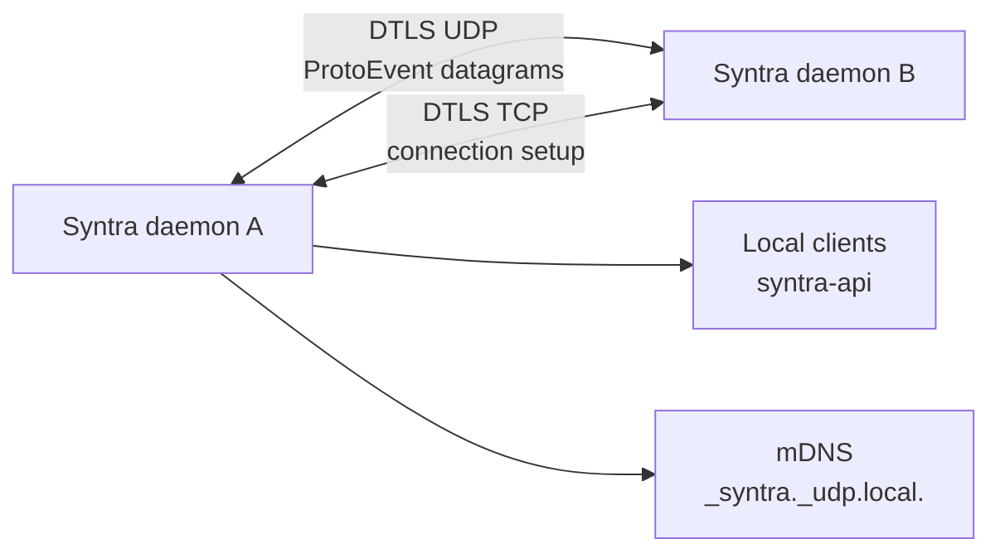

# Syntra machine-to-machine protocol

## Scope and the boundary with the local API

This document specifies the protocol spoken between two Syntra machines. It is the
wire format implemented by `crates/syntra-proto`; it is not the daemon-to-client
API in `crates/syntra-api`. The latter is a local, newline-delimited JSON
interface for the dashboard and CLI. This protocol carries input, liveness,
profiles, clipboard data, files and history between authenticated peers
(`crates/syntra-proto/src/lib.rs:1-16`).

The protocol crate deliberately has no internal crate dependencies. A compatible
implementation can therefore use the event definitions without importing the
client API. The daemon remains the authoritative owner of capture, emulation,
peer state and persistence; clients request those operations through the other
contract, not through this wire format.

## Architecture at a glance



There are three independent contracts:

| Contract | Direction | Framing | Purpose |
|---|---|---|---|
| `syntra-api` | daemon ↔ local client | newline-delimited JSON over Unix socket (loopback TCP on Windows) | dashboard/CLI control |
| `syntra-plugin-api` | daemon ↔ plugin process | newline-delimited JSON over stdio | clipboard and FUSE plugins |
| `syntra-proto` | machine ↔ machine | DTLS datagrams carrying hand-written binary events | input, transfer and history |

Do not substitute JSON API messages for protocol events. They have different
trust boundaries, transports and compatibility rules.

## Transport and addressing

### Channels

Events are sent as individual DTLS datagrams over UDP. Connection establishment
uses TCP, also protected by DTLS (`crates/syntra-proto/src/lib.rs:3-6`). The
listener binds `0.0.0.0:port` (`crates/syntra-core/src/listen.rs:112-114`), and
receives one complete datagram per `recv`; a malformed datagram is discarded
without desynchronising subsequent messages (`crates/syntra-core/src/listen.rs:252-277`).

The default port is `4242` (`syntra-api/src/lib.rs:95-96`); callers use that
value whenever a peer has no explicit port
(`crates/syntra-core/src/connect.rs:249-254`). A discovered or manually
configured peer may advertise a custom port; the daemon can replace its listener
and publishes the change through discovery
(`crates/syntra-core/src/listen.rs:159-171`,
`crates/syntra-core/src/discovery.rs:194-220`).

Every connection has a socket address `(IP, port)`, but the address is only a
route. It is not an identity: DHCP, mDNS changes, multiple interfaces and NAT
can all change it. After the DTLS handshake the daemon obtains the peer
certificate and computes its SHA-256 fingerprint as lower-case, colon-separated
hex (`crates/syntra-core/src/crypto.rs:21-35`). Connection maps may be keyed by
address, while authorisation and peer continuity must use the fingerprint.

The connector resolves all configured addresses and tries them, then records the
successful address and its fingerprint (`crates/syntra-core/src/connect.rs:249-278`).
A stale connection cannot tear down a newer connection which reused the same
address (`crates/syntra-core/src/connect.rs:451-477`).

### DTLS requirements

The listener requires a client certificate, requires the extended master secret,
and verifies the presented certificate before accepting the connection
(`crates/syntra-core/src/listen.rs:77-109`). This is mutual certificate
authentication, not anonymous encryption. A peer that has no certificate is
rejected by the connector (`crates/syntra-core/src/connect.rs:264-269`).

## Discovery

Syntra advertises and browses the mDNS service type `_syntra._udp.local.`
(`crates/syntra-core/src/discovery.rs:6`, `crates/syntra-core/src/discovery.rs:48-58`).
An advertisement contains an instance name, display name, port and an `app=syntra`
property (`crates/syntra-core/src/discovery.rs:270-290`). The instance is derived
from a sanitised display name plus a fingerprint suffix, so two devices with the
same display label remain distinguishable (`crates/syntra-core/src/discovery.rs:333-359`).

The browser receives resolved services, deduplicates addresses, and emits a
snapshot of at most 256 peers (`crates/syntra-core/src/discovery.rs:6-7`,
`crates/syntra-core/src/discovery.rs:217-239`, `crates/syntra-core/src/discovery.rs:298-329`).
The daemon turns each hostname/address and port into connection candidates.
Hostname resolution uses the operating system resolver, including hosts files,
DNS and platform mDNS/Bonjour support (`crates/syntra-core/src/dns.rs:114-127`).

Discovery is a hint, not authorisation. A discovered service still has to complete
DTLS certificate verification and appear in the authorised-key set.

## Authentication and authorisation

### Identity

A device stores a self-signed DTLS certificate. Its identity is the SHA-256
fingerprint of the first DER certificate, formatted as 32 pairs of lower-case
hexadecimal characters separated by colons (`crates/syntra-core/src/crypto.rs:21-35`).
The certificate/key is loaded from disk or generated if absent; regeneration
atomically replaces the persisted identity (`crates/syntra-core/src/crypto.rs:37-53`,
`crates/syntra-core/src/crypto.rs:73-104`). Regeneration changes the fingerprint
and consequently requires re-authorisation at every peer.

### Authorised keys

Configuration stores an authorised-key map keyed by fingerprint. The DTLS
verification callback accepts exactly a fingerprint present in that map
(`crates/syntra-core/src/listen.rs:67-101`). Unknown fingerprints are queued as
rejected connection attempts and surfaced to the daemon (`crates/syntra-core/src/listen.rs:140-147`).
The value associated with a key is presentation metadata; it does not replace
the fingerprint as the stable principal.

Approval is an explicit local operation: inspect the pending fingerprint and add
it to the authorised set, then reconnect or wait for the peer to retry. Removing
an authorised key prevents future DTLS handshakes; it does not magically revoke
an already established session. The daemon exposes add/remove operations through
its local client layer (`crates/syntra-core/src/service.rs:34-35`,
`crates/syntra-core/src/service.rs:121-127`).

After authentication, received events are tagged internally with the peer
fingerprint before entering daemon state (`crates/syntra-core/src/connect.rs:378-409`).
An address alone must never be used to approve a peer.

## Framing and primitive encoding

Every datagram begins with one event-type byte. `EventType` is a `#[repr(u8)]`
enum and its discriminants are assigned in declaration order, starting at zero
(`crates/syntra-proto/src/lib.rs:629-673`). The remaining bytes are the event
body. All integer helpers use network byte order (big-endian): `u16`, `u32`,
`u64`, `i32` and IEEE-754 `f64` are written with `to_be_bytes` and read with the
corresponding `from_be_bytes` helpers (`crates/syntra-proto/src/lib.rs:1797-1904`).

Strings are UTF-8 preceded by a big-endian `u16` byte length. Optional strings
use a zero length for `None`; optional `u64` uses a one-byte presence flag followed
by the value when present (`crates/syntra-proto/src/lib.rs:1513-1596`). Raw
vectors have the length implied by the enclosing datagram or an explicit count
where shown below. There is no serde envelope, schema hash or alignment padding.

`encode` rejects oversized or semantically invalid values; `decode` rejects
truncation, invalid enum values, invalid UTF-8, trailing bytes and values outside
limits (`crates/syntra-proto/src/lib.rs:728-1494`,
`crates/syntra-proto/src/lib.rs:1854-1863`). Maximums include 16 KiB per datagram,
64 MiB per clipboard, 48 MiB per history record and 1024-byte paths
(`crates/syntra-proto/src/lib.rs:23-40`, `crates/syntra-proto/src/lib.rs:82-91`).

## Compatibility and Hello

`Hello` is sent immediately after DTLS setup and contains the local eight-byte
build commit; the receiving daemon stores it as `peer_commit` and forwards the
event to state consumers (`crates/syntra-core/src/connect.rs:290-307`,
`crates/syntra-core/src/connect.rs:397-405`). The protocol module documents this
field as the version/build identity negotiated by peers (`crates/syntra-proto/src/lib.rs:12-16`).

The compatibility rule is deliberately asymmetric: adding a new event variant
is safe because each DTLS receive is already message-framed and an unknown or
malformed event is ignored while the connection remains open
(`crates/syntra-core/src/connect.rs:412-416`). Reshaping an existing variant is
not safe: its discriminator and body positions are already consumed by deployed
peers. Any such change requires a protocol-version bump and a compatibility
policy in the handshake. A new implementation must therefore preserve every
existing discriminator and field layout, and must not reinterpret an old body
under a new meaning.

A Hello is not a substitute for DTLS authentication. It identifies the software
build after the certificate has authenticated the machine, but it does not grant
access or authorise capabilities.

## Complete `ProtoEvent` reference

The table lists the body after the one-byte discriminator. Fields occur exactly
in the displayed order. `u8`, `u16`, `u32`, `u64`, `i32` and `f64` are big-endian
unless explicitly described as raw bytes. `bytes` consumes the remaining body
for chunk events. Event discriminators are the `EventType` declaration index
(`crates/syntra-proto/src/lib.rs:629-673`).

| # | Variant and body encoding |
|---:|---|
| 0 | `Enter(Position)`: `position:u8`; `Position` is `0=Left, 1=Right, 2=Top, 3=Bottom` (`lib.rs:263-270`, `lib.rs:862-866`). |
| 1 | `Leave(u32)`: `serial:u32` (`lib.rs:866-867`). |
| 2 | `Ack(u32)`: `serial:u32` (`lib.rs:867-868`). |
| 3 | `Input(Pointer::Motion)`: `time:u32, dx:f64, dy:f64` (`lib.rs:823-826`). |
| 4 | `Input(Pointer::Button)`: `time:u32, button:u32, state:u32` (`lib.rs:827-835`). |
| 5 | `Input(Pointer::Axis)`: `time:u32, axis:u8, value:f64` (`lib.rs:837-840`). |
| 6 | `Input(Pointer::AxisDiscrete120)`: `axis:u8, value:i32` (`lib.rs:841-844`). |
| 7 | `Input(Keyboard::Key)`: `time:u32, key:u32, state:u32` (`lib.rs:846-850`). |
| 8 | `Input(Keyboard::Modifiers)`: `depressed:u32, latched:u32, locked:u32, group:u32` (`lib.rs:851-860`). |
| 9 | `Ping`: no body (`lib.rs:861-862`). |
| 10 | `Pong(bool)`: `alive:u8`, `0=false`, `1=true` (`lib.rs:862-865`). |
| 11 | `Hello`: `commit:[u8;8]` raw bytes (`lib.rs:866-868`). |
| 12 | `ClipboardStart`: `transfer_id:u64, total_len:u32, chunks:u32` (`lib.rs:921-930`). |
| 13 | `ClipboardChunk`: `transfer_id:u64, index:u32, data:bytes`; total datagram is capped at 16 KiB (`lib.rs:945-961`). |
| 14 | `ClipboardImageStart`: `transfer_id:u64, width:u32, height:u32, total_len:u32, chunks:u32` (`lib.rs:932-944`). |
| 15 | `ClipboardCapabilities`: `text:u8, image:u8, files:u8`, each boolean byte (`lib.rs:962-965`). |
| 16 | `ClipboardManifest`: `transfer_id:u64, entry_count:u32`, then each entry `file_id:u64, kind:u8, path_len:u16, path:bytes, size:u64`; kind `0=Directory, 1=File` (`lib.rs:966-969`, `lib.rs:1619-1719`). |
| 17 | `ClipboardFileRequest`: `transfer_id:u64, file_id:u64, request_id:u64, offset:u64, length:u64` (`lib.rs:970-982`). |
| 18 | `ClipboardFileChunk`: `transfer_id:u64, file_id:u64, request_id:u64, offset:u64, data:bytes` (`lib.rs:985-999`). |
| 19 | `ClipboardFileComplete`: `transfer_id:u64, file_id:u64, request_id:u64, size:u64, digest:[u8;32]` (`lib.rs:1000-1007`). |
| 20 | `ClipboardTransferCancel`: `transfer_id:u64, file_id:u64` where zero means absent, then `reason:u8` (`lib.rs:1015-1027`); reason `0=User, 1=IoError, 2=Protocol`. |
| 21 | `ClipboardTransferProgress`: `transfer_id:u64, file_id:u64, completed:u64, total:u64` (`lib.rs:1028-1041`). |
| 22 | `HistorySyncRequest`: `request_id:u64, offset:u64` (`lib.rs:1042-1044`). |
| 23 | `HistoryRecordStart`: `request_id:u64, record_id:u64, total_len:u32, chunks:u32` (`lib.rs:1045-1053`). |
| 24 | `HistoryRecordChunk`: `request_id:u64, record_id:u64, index:u32, data:bytes` (`lib.rs:1054-1074`). |
| 25 | `HistorySyncPageEnd`: `request_id:u64, next_offset:u64` with presence `u8` first; absent is zero (`lib.rs:1075-1081`). |
| 26 | `HistoryClearBoundaryRequest`: `operation_id:[u8;16]` (`lib.rs:1082-1084`). |
| 27 | `HistoryClearBoundary`: `operation_id:[u8;16], boundary_count:u16`, then entries `device_id_len:u16, device_id:bytes, sequence:u64` (`lib.rs:1085-1095`, `lib.rs:1529-1572`). |
| 28 | `HistoryClearApply`: same body as `HistoryClearBoundary` (`lib.rs:1089-1095`). |
| 29 | `HistoryClearAck`: `operation_id:[u8;16], affected:u64, error` where optional error is `u16 length + UTF-8`, zero length means none (`lib.rs:1097-1104`). |
| 30 | `ProfileStart`: `request_id:u64, width:u32, height:u32, total_len:u32, chunks:u32, name_len:u8, display_name:bytes` (`lib.rs:874-904`). |
| 31 | `ProfileChunk`: `request_id:u64, index:u32, data:bytes` (`lib.rs:905-919`). |
| 32 | `ProfileRequest`: `request_id:u64` (`lib.rs:868-871`). |
| 33 | `ProfileChanged`: no body (`lib.rs:862-864`). |
| 34 | `ManualFileOffer`: `transfer_id:u64, name_len:u16, file_name:bytes, size:u64` (`lib.rs:734-747`). |
| 35 | `ManualFileDecision`: `transfer_id:u64, decision:u8`; `0=Pending, 1=Accepted, 2=Declined` (`lib.rs:748-760`). |
| 36 | `ManualFileRequest`: `transfer_id:u64, offset:u64, length:u32` (`lib.rs:762-773`). |
| 37 | `ManualFileChunk`: `transfer_id:u64, offset:u64, data:bytes` (`lib.rs:774-785`). |
| 38 | `ManualFileComplete`: `transfer_id:u64, sha256:[u8;32]` (`lib.rs:786-795`). |
| 39 | `ManualFileResult`: `transfer_id:u64, success:u8, error` (optional `u16`-length UTF-8 string) (`lib.rs:796-816`). |
| 40 | `ManualFileCancel`: `transfer_id:u64` (`lib.rs:817-821`). |

There are 41 wire discriminators and 40 top-level `ProtoEvent` variants: the
six input forms share the single `Input(InputEvent)` Rust variant while having
distinct wire discriminators. Implementers must document and implement all 41
wire forms, not merely count Rust enum arms
(`crates/syntra-proto/src/lib.rs:287-435`, `crates/syntra-proto/src/lib.rs:629-673`).

## Transfer protocols

### Text and image clipboard

A sender chooses a non-zero `transfer_id`, sends `ClipboardStart` or
`ClipboardImageStart`, then sends zero-based chunks. `total_len` and `chunks` are
validated against the configured maximum and the exact expected chunk count
(`crates/syntra-proto/src/lib.rs:1597-1617`, `crates/syntra-proto/src/lib.rs:1801-1826`).
Chunk payloads are bounded by `MAX_CLIPBOARD_CHUNK_SIZE`; image dimensions and
RGBA size are checked for multiplication overflow. The receiver must assemble
only the declared transfer and reject missing, duplicate or out-of-range chunks.

`ClipboardCapabilities` is a three-boolean capability advertisement for text,
image and files. It does not authorise a transfer; it tells the peer which forms
are useful (`crates/syntra-proto/src/lib.rs:107-112`).

### Clipboard files

A file transfer starts with `ClipboardManifest`. Entries have strictly increasing
non-zero file IDs, UTF-8 relative paths, a kind and a declared size. Empty paths,
absolute paths, `..`, backslashes and oversized paths are rejected
(`crates/syntra-proto/src/lib.rs:1619-1743`). Directories must have size zero;
manifest entry count is at most 256.

The receiver requests ranges using `(transfer_id, file_id, request_id, offset,
length)`. The sender replies with chunks carrying the same IDs and offset. File
chunks are deliberately limited to a 1200-byte safe datagram budget, leaving room
for the five-field header (`crates/syntra-proto/src/lib.rs:31-38`). Completion
includes the final size and a 32-byte digest. The receiver must verify both before
publishing the file. `ClipboardTransferProgress` is advisory progress, while
`ClipboardTransferCancel` terminates a transfer or one file and states whether
the cause was user cancellation, I/O or protocol error.

### Manual file offers

Manual transfers are separate from clipboard manifests. The offer names one file,
its size and a transfer ID. The recipient decides, then requests ranges; the
sender emits chunks and a SHA-256 completion. A result carries success and an
optional bounded error string. Every transfer ID must be non-zero, and manual
names are validated against the 1024-byte limit (`crates/syntra-proto/src/lib.rs:37-40`,
`crates/syntra-proto/src/lib.rs:81-81`, `crates/syntra-proto/src/lib.rs:1369-1468`).

## History synchronisation

History is paged rather than streamed. A client starts with `HistorySyncRequest`
containing a request ID and record offset. The peer emits zero or more
`HistoryRecordStart`/`HistoryRecordChunk` sequences and closes the page with
`HistorySyncPageEnd`. `next_offset` is optional: absent means no more records;
present means request another page at that offset (`crates/syntra-proto/src/lib.rs:368-383`,
`crates/syntra-proto/src/lib.rs:415-418`).

Record payloads are bounded by 48 MiB and chunk payloads by the safe datagram
limit. A record's declared chunk count must equal the ceiling of its length over
the configured chunk size (`crates/syntra-proto/src/lib.rs:1495-1511`). Request
IDs permit concurrent pages; record IDs identify the history record being
reassembled. The daemon's synchroniser persists only a complete, validated
record (`crates/syntra-core/src/history_sync.rs:1-187`).

### Coordinated global clear

A global clear is a four-stage protocol:

1. `HistoryClearBoundaryRequest(operation_id)` asks peers for their deletion
   boundary.
2. Each peer returns `HistoryClearBoundary(operation_id, boundary)`, a bounded
   list of `(device_id, sequence)` watermarks.
3. The initiator sends `HistoryClearApply` with the agreed boundary.
4. Each peer replies with `HistoryClearAck`, reporting affected rows and an
   optional error.

The operation ID is exactly 16 raw bytes and correlates all stages. Device IDs
are UTF-8, non-empty and at most 128 bytes; there are at most 100 boundary
entries (`crates/syntra-proto/src/lib.rs:82-87`, `crates/syntra-proto/src/lib.rs:1529-1572`).
This is coordinated deletion, not merely a local UI action: a peer should apply
the boundary only for the matching operation and return an acknowledgement.

## Worked byte-level example

Encode `Pong(true)`. `EventType::Pong` is discriminator 7 because the input
wire forms occupy 0–5 and `Ping` is 6 (`crates/syntra-proto/src/lib.rs:629-640`).
The body writes the boolean as one byte (`crates/syntra-proto/src/lib.rs:862-865`).
The complete datagram is therefore:

```text
07 01
```

`07` means Pong; `01` means alive. `Pong(false)` is `07 00`. No length prefix,
checksum, padding or JSON text is added by this layer; DTLS supplies transport
confidentiality/integrity and datagram boundaries.

For a multi-byte example, `ProfileRequest { request_id: 0x0102030405060708 }`
uses discriminator 32 followed by the big-endian `u64`:

```text
20 01 02 03 04 05 06 07 08
```

A decoder consumes exactly nine bytes and rejects any trailing byte
(`crates/syntra-proto/src/lib.rs:116-1494`).

## Failure modes and implementation guidance

| Condition | Required handling |
|---|---|
| Unknown discriminator | Ignore the datagram and keep the DTLS session alive; this is the forward-compatibility mechanism (`crates/syntra-core/src/connect.rs:412-416`). |
| Truncated body | Reject that datagram; do not read into the next message (`crates/syntra-proto/src/lib.rs:1854-1863`). |
| Invalid UTF-8 or enum byte | Reject the datagram and log/debug it; never substitute a default. |
| Oversized datagram | Reject above `MAX_DATAGRAM_SIZE` (`crates/syntra-proto/src/lib.rs:23-28`). |
| Zero IDs or invalid ranges | Reject transfer/request/file events; IDs and offset+length are validated (`crates/syntra-proto/src/lib.rs:1828-1854`). |
| DTLS certificate absent | Close the connection; an address is not sufficient (`crates/syntra-core/src/connect.rs:264-269`). |
| Fingerprint not authorised | Reject handshake and surface the fingerprint for approval (`crates/syntra-core/src/listen.rs:87-100`, `:140-147`). |
| No Pong response | Send four pings at 500 ms intervals, then close (`crates/syntra-core/src/connect.rs:319-339`). |
| DTLS receive parse error | Keep listening; the next `recv` starts a fresh datagram (`crates/syntra-core/src/listen.rs:260-277`). |
| File digest mismatch | Treat completion as failed and do not publish the file. |

A compatible peer should preserve field order, use checked arithmetic, enforce
all declared limits before allocating, and treat every datagram as untrusted.
Round-trip tests in the protocol crate cover the hand-written representations,
but an external implementation must independently test malformed lengths,
unknown discriminators and integer overflow paths.

## Limitations and known weaknesses

* The source documents Hello as carrying an eight-byte commit/version identity,
  but the current receive path records and forwards it without rejecting an
  incompatible value. Compatibility negotiation is therefore best-effort rather
  than a hard version gate (`crates/syntra-core/src/connect.rs:290-307`,
  `crates/syntra-core/src/connect.rs:397-405`).
* Unknown events are ignored, which enables additive evolution but can silently
  lose functionality when a new feature is required by the sender.
* File chunks rely on a 1200-byte safe size. Larger protocol datagrams may be
  fragmented or dropped on ordinary MTUs, and a stalled transfer has no general
  retransmission protocol beyond issuing another range request
  (`crates/syntra-proto/src/lib.rs:31-38`).
* The protocol validates paths syntactically, but filesystem policy, quotas,
  overwrite behaviour and sandboxing remain daemon/application responsibilities.
* SHA-256 digests detect accidental corruption and mismatched content; they are
  not a second peer-authentication mechanism. DTLS certificate trust is the
  security boundary.
* The fingerprint is derived from the first certificate bytes. Replacing a
  certificate intentionally changes identity, and there is no address-independent
  automatic migration (`crates/syntra-core/src/crypto.rs:32-35`,
  `crates/syntra-core/src/crypto.rs:73-104`).
* mDNS is local-network discovery only and may be unavailable or blocked. Manual
  addresses and OS name resolution are required for routed networks
  (`crates/syntra-core/src/discovery.rs:147-255`, `crates/syntra-core/src/dns.rs:114-127`).
* The protocol has no generic per-message acknowledgement, ordering layer or
  replay window. Reliability and idempotency are implemented by individual
  sub-protocols and daemon state machines.
* A global clear coordinates watermarks but cannot make an offline peer apply the
  operation until it reconnects; callers must account for that operational gap.

## Source map

The normative wire definitions and encoder/decoder are in
`crates/syntra-proto/src/lib.rs:286-1494`. Transport acceptance and framing are
in `crates/syntra-core/src/listen.rs:67-287` and connection setup/liveness in
`crates/syntra-core/src/connect.rs:232-478`. Discovery and name resolution are
in `crates/syntra-core/src/discovery.rs:1-360` and `crates/syntra-core/src/dns.rs:114-127`.
Certificate fingerprints and persistence are in
`crates/syntra-core/src/crypto.rs:21-104`.
